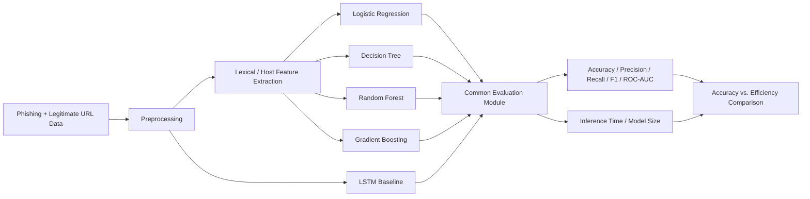

# Lightweight Machine Learning for Phishing URL Detection

## Progress Report 1 Repository

This repository contains the initial design and implementation work for a project comparing lightweight machine learning models with a deep-learning baseline for phishing URL detection.

### Current progress

- Defined the main research question: can lightweight, interpretable models approach deep-learning detection performance while using less computation and memory?
- Identified candidate datasets: PhishTank and the UCI Phishing Websites dataset.
- Defined planned lightweight models: logistic regression, decision tree, random forest, and gradient boosting.
- Defined a planned LSTM-based deep-learning baseline.
- Defined evaluation metrics: accuracy, precision, recall, F1 score, ROC-AUC, inference time per URL, and model size.
- Implemented an initial lexical URL feature-extraction prototype.
- Generated reproducible demo feature output from synthetic/example URLs.

> **Important:** The CSV in `outputs/` is a feature-extraction demonstration, not a trained-model result. Full dataset collection, model training, and benchmarking are the next phase.

## Initial system design



## Repository structure

```text
phishing_url_project_progress1/
├── README.md
├── requirements.txt
├── data/
│   └── demo_urls.csv
├── outputs/
│   └── demo_features.csv
└── src/
    └── feature_extraction.py
```

## Run the current prototype

```bash
python src/feature_extraction.py
```

## Next steps

1. Download and clean the selected phishing/legitimate URL datasets.
2. Expand feature extraction to host-based features where feasible.
3. Create train/validation/test splits.
4. Train the lightweight baseline models.
5. Implement the LSTM baseline.
6. Compare all models on the same held-out test set.
7. Benchmark inference latency and model size.
8. Test performance under constrained CPU/memory conditions.
